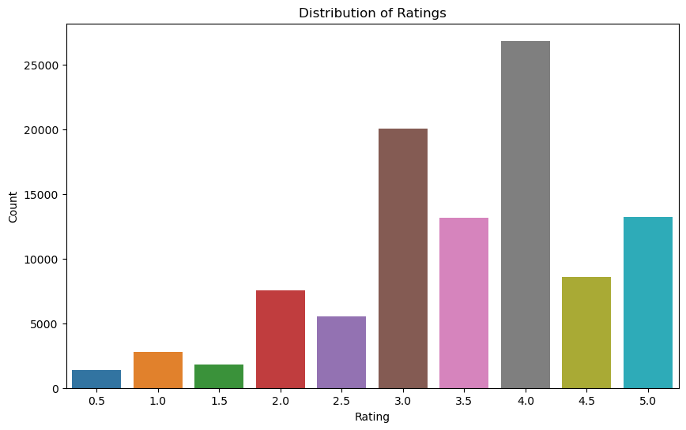
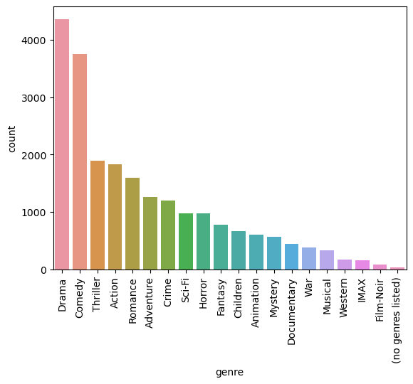

# MOVIE RECOMMENDER SYSTEM
 
 ### Authors
 * Jeremy Waiguru
 * Paul Ngatia
 * Winfred Bundi
 * Mercy Kiragu

 ## Business Overview
* Objective: Develop a versatile movie recommendation system using the following  techniques ;
* Simple Recommender: Ranks movies by popularity using metrics like ratings count and user reviews to generate a list of top-rated movies.
* Collaborative Filtering: The main recommender, analyzing user behavior and preferences to suggest movies based on similar users or movies.
* Hybrid Recommendation model: Addresses the cold-start problem by recommending movies based on intrinsic features like genre, director, and actors, useful for new users and items.
* Evaluation: Success measured using RMSE and MAE scores to ensure effectiveness and accuracy.

## Problem Statement
BingeMax needs to enhance user satisfaction and engagement by developing a robust movie recommendation system. This system will suggest the top 5 movies to each user based on their ratings of other films, utilizing the MovieLens "small" dataset. 
The effectiveness of this system is crucial for improving user interaction, retention, and overall engagement on the platform.

## Data Understanding
Dataset: MovieLens
Files: movies.csv, ratings.csv, links.csv, tags.csv
Key Variables:
userId: Identifier for the user
movieId: Identifier for the movie
rating: User rating (e.g., 1 to 5 stars)
timestamp: When the rating was given (Unix epoch format)
title: Movie title
genres: List of genres for the movie
Source: MovieLens Dataset

## Visualizations

The top-rated movies received a score of 5, while the lowest-rated ones were rated as low as 0.5. Most films were rated either 3 or 4, with a minority receiving ratings of 0.5 or 1.5.

The top 5 genres are: Drama, Comedy, Thriller, Action and Romance

## Modelling Process
* To build a recommendation system, we used several models.

1. Popularity Model: Recommends the most popular items to all users based on overall interactions.

2. Collaborative Filtering Models:

3. SVD: Decomposes the user-item matrix into latent factors to capture hidden relationships.
4. KNNBaseline: Uses k-nearest neighbors with baseline ratings, accounting for user and item biases.
5. KNNWithMeans: Normalizes ratings by subtracting user averages before applying KNN.
6. KNNBasic: Applies KNN directly to raw ratings.
7. Hybrid Model: Combines SVD and cosine similarity, leveraging both latent factors and direct item similarities.
Performance was evaluated using metrics RMSE  with the hybrid model often performing best.

## Evaluation 
In the intial modeling, SVD produced an RMSE of 0.8153, KNN Baseline produced an RMSE of 0.8191 and KNN with Means had an RMSE of 0.8409 while KNN Basic produced an RMSE of 0.9081

Hybrid Recommender system was the best performing model with initial RMSE of 0.2886

## Conclusions
* The Hybrid recommendation model  proved to be the most accurate with an RMSE of 0.2886 which is the lowest rmse. 
* The hybrid recommendation system, which combines collaborative filtering (SVD) with content-based filtering, effectively leverages the strengths of both methods. 
* This integrated approach enhances recommendation accuracy, handles the cold-start problem, and provides a more personalized user experience.

## Recommendations
1. Enhance User Engagement:
Bingemax should Incorporate user feedback mechanisms to refine recommendations..
2. Leverage Marketing Insights:
Use recommendation data to target marketing and promotions effectively.
3. Ensure Data Privacy:
Implement robust privacy measures and communicate policies clearly.
4. Partner with Content Creators:
Collaborate with studios for early access to new releases.
5. Build Community:
Foster user interaction through reviews, lists, and forums.
6. Monitor Performance:
Track system performance in real-time and address issues promptly.
7. Plan for Scalability:
Design the system to handle growth and expanding data efficiently.

